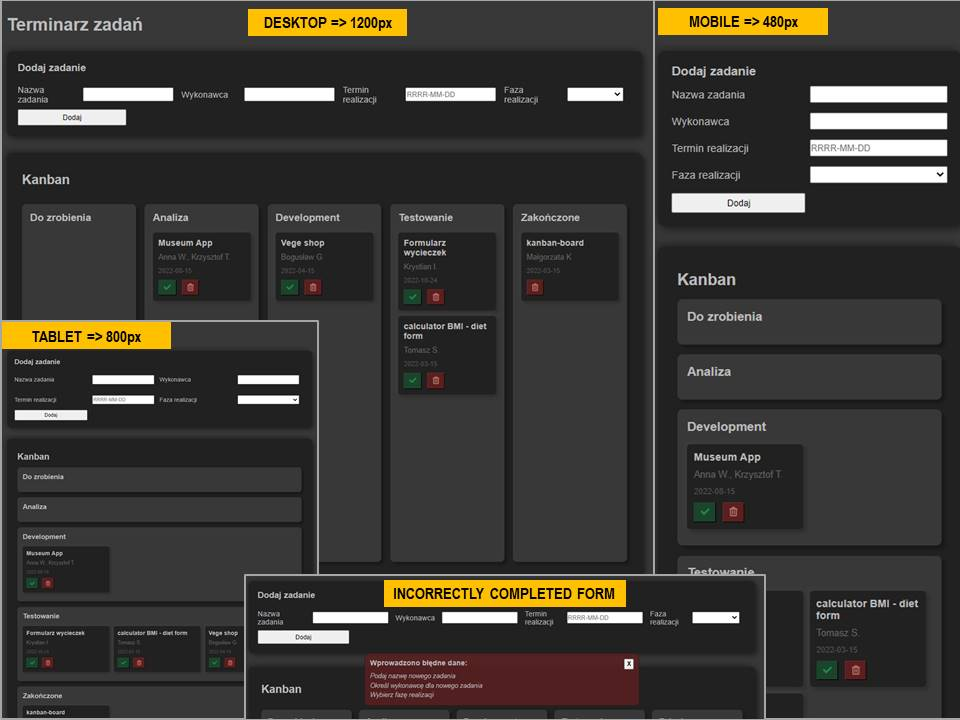

# KANBAN BOARD (React and Hooks)

&nbsp;

## Table of contents

[⭐ Overview](#⭐-overview)
  - [The challenge](#the-challenge)
  - [Instalation](#Installation-💿)
  - [Links](#links)

[💡 My process](#💡-my-process)
  - [Technologies](#Technologies)
  - [Solutions provided in the project](#Solutions-provided-in-the-project)
  - [Useful resources](#useful-resources)
  - [Copyrights](#copyrights)

[Screenshot](#screenshot)

[🙋‍♂️ Author](#🙋‍♂️-author)

[👏 Special Thanks](#👏-special-thanks)


&nbsp;

## ⭐ Overview

&nbsp;

### **The challenge:**

It was my first small project using `React` and `Hooks`.
The challenge was to implement the Kanban system similar to this one: https://kanbanblog.com/explained/.
&nbsp;

To familarize the Kanban concept I recommend watching the [video](https://www.youtube.com/watch?v=iVaFVa7HYj4&list=PLaD4FvsFdarR3oF1gp5_NmnlL-BQIE9sW&index=1).

The Kanban Board enables:

- Create tasks;
- Assign a person to the task;
- Set deadline of the task;
- Move defined tasks to the next columns with defined limits;
- Save tasks to Local Storage;
- Delete tasks from the Local Storage.

&nbsp;

### **Installation 💿**

The project uses [node](https://nodejs.org/en/), [npm](https://www.npmjs.com/), [webpack](https://webpack.js.org/) and compiler [babel](https://babeljs.io/setup#installation) as well as `ESLint` and `Prettier`.

Having them installed, type into the terminal: 
```
npm i
```
Then, you may run webpack typing in the terminal:

```
npm start
```
App is available using the following addresses:
-http://localhost:8080

&nbsp;

### **Links:**
- [GitHub Pages](https://kowackag.github.io/kanban-react-pages/)
- [GitHub](https://github.com/kowackag/kanban-board-react.git)

&nbsp;
 
## 💡 My process

&nbsp;

### **Technologies:**


&nbsp;
  
### **Solutions provided in the project:**
- HTML:
    - The project was built using semantic HTML5 markup.
- CSS:
    - The css styles (`main.css`) is loaded into `<head>` section  thanks to `webpack`, using the appropriate loader in `webpack.config.js` for files with the extension` .css`.
    - The form was made using CSS Grid layout.
    - As the app is mainly used on desktop computers, it was prepared with a Desktop-first approach.
- JS:
    - ES2015+ (arrow functions, destructuring, spread operator)
- React:
    - The following hooks were used: `useState`, `useContext`, `useReducer` and `Custom Hook`.
    - Data is stored in `state` in the `<App /> ` and passed to the Components using the `Context API`.


Kanban board `<Board />` consists with a few Components:  
- `<Form />` to create new tasks with erros `<section>` to display fields that did not pass validation;
- `<Column />` with the maximum number of tasks;
- `<Task />` to display all tasks, move them to the next stage or delete;
- `<Footer />`

Hook `useReducer` is used to control the form with user inputs. Thanks to destructuring it is possible to conveniently store data.

```
const reducer = (state, {type, element}) => {
        switch (type) {
        case 'reset':
            return init;
        case 'change':
            const {name, value} = element;
            return {...state, [name]:value};
        default:
            return state;
        }
    }
```

&nbsp;

#### Data storage

To save and store data the [localStorage](http://kursjs.pl/kurs/storage/storage.php) built into a web browser was used.
&nbsp;

The custom hook `useStorage` was created, to provide methods for saving and reading data from localStorage:
```
const useStorage = () => {
    const setItem = (ob, name) => {
        localStorage.setItem(name, JSON.stringify(ob))
    }
    const getItem = (name) => {
        const retrivedObject = JSON.parse(localStorage.getItem(name));
        return retrivedObject;
    }
    return [getItem, setItem];
```

The hook `useStorage` was used in `<App/>`:
```
const [getItem, setItem] = useStorage();
```
Data structure: 

Columns with the name of the implementation stage, the limit of tasks and the identifier:
```
columns: [
    {id: 1, name: 'To do', limit: 5},
    {id: 2, name: 'Analysis', limit: 5},
    {id: 3, name: 'Development', limit: 5},
    {id: 4, name: 'Testing', limit: 3},
    // ...
]
``` 
Tasks structure:
```
tasks: [
    {id: 1, name: 'Task1', idColumn: 1, user: 'Ann', deadline: ''},
    {id: 2, name: 'Task2', idColumn: 1, user: 'Anna', deadline: ''},
    {id: 3, name: 'Task3', idColumn: 1, user: 'Anna', deadline: ''},
    // ...
]
```
### **Useful resources:**

- [Kanban system](https://www.youtube.com/watch?v=iVaFVa7HYj4&list=PLaD4FvsFdarR3oF1gp5_NmnlL-BQIE9sW&index=1)
- [Font Awesome](https://fontawesome.com/) - Icons. 
- [localStorage](http://kursjs.pl/kurs/storage/storage.php)

&nbsp;
## **Screenshot:**
&nbsp;


&nbsp;

## 🙋‍♂️ Author

The project was made by Małgorzata Kowacka.
- kowackag@gmail.com
- GitHub - [kowackag](https://github.com/kowackag)
- Linked - [Małgorzata Kowacka](https://www.linkedin.com/in/ma%C5%82gorzata-kowacka-0258a812a/)

 **If you have any questions do not hesitate to contact me.**

&nbsp;

## 👏 Special thanks  
Thanks to my [Mentor - devmentor.pl](https://devmentor.pl/) - for providing me with this task and for code review.

&nbsp;

My next small project using REACT basics  [CLICK ME ](https://github.com/kowackag/diet-form-and-calc-BMI) 

----